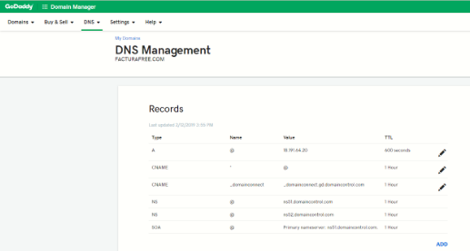
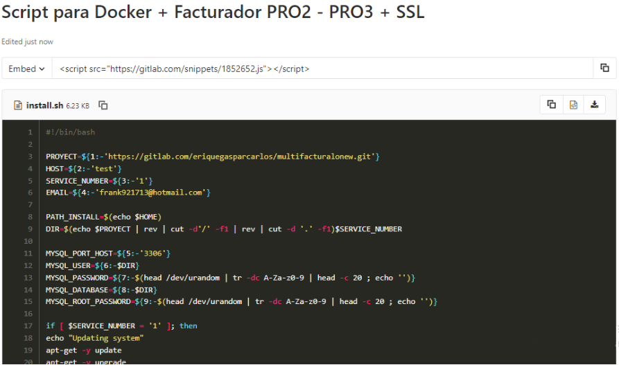
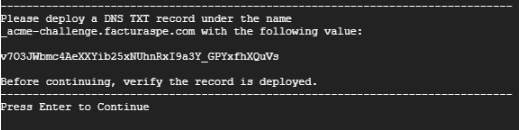
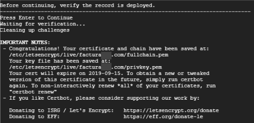

# Manual de Instalación
## Docker + GitLab + SSL

### Descripción

Hemos elaborado un script para uso en instancias Linux, que es un archivo .sh que actualiza el sistema, instala herramientas, sus dependencias, y configura un certificado SSL renovable cada 90 días. Este certificado debe ser confirmado en el proceso con su dominio y realiza todas las configuraciones previas, dejando el aplicativo listo para probar en menos de 20 minutos. Su ejecución es muy sencilla.

### Requisitos previos

1. Tener acceso a su servidor, VPS, máquina virtual o local vía SSH. En las instalaciones que realizamos para AWS o Google Cloud, entregamos el usuario, la IP del servidor y la clave SSH que puede ser un archivo .ppk o .pem.

2. Tener instalada una versión de SSH en su máquina para conectarse de manera remota. Puede utilizar Putty, Filezilla o una consola terminal.

3. Es importante configurar su dominio apuntando a la IP de su instancia para que durante la ejecución del script se valide el certificado SSL. Al finalizar la ejecución, no debe haber errores y todo esté listo para realizar pruebas. Edite los registros A y CNAME donde A debe contener su IP y CNAME el valor * (asterisco) para que se tomen los subdominios registrados por la herramienta.

4. Durante la ejecución del script, deberá almacenar en su dominio dos registros TXT con unos valores que se mostrarán en pantalla. Estos registros son validados en directo y no pueden tardar más de 2 minutos en validarse en su dominio.

5. En caso de contar con servicios instalados en su instancia como mysql, apache o nginx, debe detenerlos, ya que estos ocupan los puertos que pasarán a usarse con el aplicativo y los contenedores de Docker.

### Pasos

1. Acceder a su instancia vía SSH.

2. Loguearse como super usuario: `sudo su`.

3. Ubicarse en la carpeta del usuario, por ejemplo: 
`cd /home/ubuntu/`

4. Crear el archivo `install`: `touch install.sh`.

5. Editar el archivo con su editor preferido: `nano install.sh`.

6. En el archivo, debe agregar el contenido del siguiente enlace: [GitLab Snippet](https://gitlab.com/snippets/1852652).
Observará a una página como la siguiente, donde debe copiar el contenido del script y pegarlo en su archivo install.sh, es importante que mantenga las estructura del mismo.

7. Para salir del editor y guardar, presione "**ctrl + x**". Luego se le consultará si desea guardar los cambios, confirme con "**y**" y luego "**enter**".

8. Darle permisos de ejecución al archivo: 
ejecute **chmod +x install.sh**

9. El comando a utilizar requiere de dos parámetros principalmente: 
<pre>./install.sh [repositorio] [dominio]</pre>
Por ejemplo: 
<pre>./install.sh https://gitlab.com/rash07/facturadorpro2 elfacturador.com</pre>

10. Una vez ejecutado el comando, se iniciará un proceso donde debe ir aceptando las preguntas y que le mostrará en pantalla los valores que debe añadir en los 2 registros tipo TXT de su dominio con nombre 
     - **a.** **`_acme-challenge.example.com`**  
     - **b.** **`_acme-challenge`** (casos como godday y puntope).
en la siguiente imagen le muestran el valor como **v703JW**.... debera copiarlo y añadirlo al primer record TXT, seguidamente pulsar enter, se le mostrará en pantalla un segundo valor para el segundo TXT

11. Editados los registros en su dominio, deberá aceptar para continuar y que el proceso verifique que sea exitoso. De ser exitoso, obtendrá una pantalla similar a la siguiente:

12. Continuará el proceso de actualización del sistema. Se le solicitará el usuario y contraseña de GitLab para clonar/descargar el proyecto en su instancia. Luego culminará y tendrá los accesos listos en su dominio:

     - Correo: **admin@gmail.com**
     - Contraseña: **123456**

Una vez finalizado, puede proseguir con el manual de pruebas o demás documentación de cada proyecto, sus URL son:
   - **PRO1:** [https://gitlab.com/rash07/facturadorpro1](https://gitlab.com/rash07/facturadorpro1)
   - **PRO2:** [https://gitlab.com/rash07/facturadorpro2](https://gitlab.com/rash07/facturadorpro2)

### Recomendaciones

- Luego de instalar el facturador, puede cambiar algunos parámetros en el archivo .env 
como:
  - La dirección de envío de correos que utiliza el facturador para enviar los archivos pdf, xml y cdr a sus clientes.
  - Cambiar algunas configuraciones de plantillas de los pdf, entre otros.

- Recuerde que siempre que se edita el archivo .env, debe utilizar el comando "php artisan config:cache" dentro del contenedor de fpm1. Para más detalles, puede observar el manual de actualización [aquí](https://docs.google.com/document/d/11PI1a9yjCPfH9CCuWmJSrdj1V8IEUffqurqvdkw29co/edit?usp=sharing).

- La ruta donde ejecute el script será donde se clone el repositorio. Debe verificar que los usuarios del servidor tengan permisos a dicha ruta si desea acceder desde ftp o scp.
